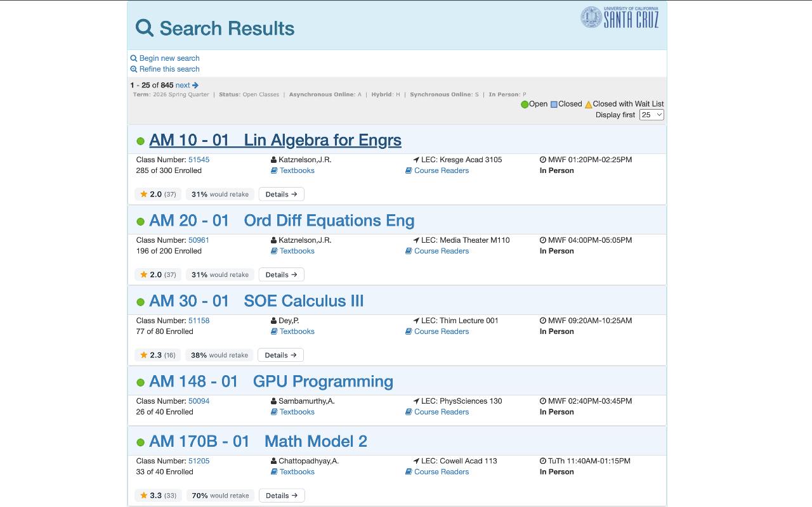
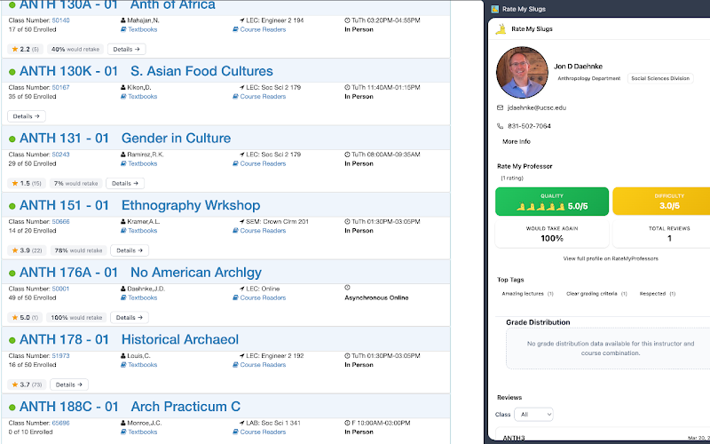

<div align="center">


# Rate My Slugs

Professor ratings, grade distributions, and detailed profiles, shown right where you browse UCSC courses on MyUCSC.

[](https://chromewebstore.google.com/detail/rate-my-slugs/ddmahbdpmhbeohjjblfopgggdbfieboo)
[](LICENSE)
[](https://github.com/IvanKuria/rate-my-slugs/releases)
[](https://developer.chrome.com/docs/extensions/mv3/intro/)
[](https://wxt.dev)

</div>

## Overview

Rate My Slugs is a Chrome extension for UCSC students. It pulls Rate My Professors ratings, campus directory details, and historical grade distributions directly into the MyUCSC enrollment experience, so you can size up a class without leaving the page or juggling browser tabs.

## Screenshots

Inline ratings on the search results page. Every class shows the professor's rating, review count, and would-retake percentage at a glance.



Click "Details" on any class to open a side panel with the full professor profile: contact info, department, Rate My Professors scores, top tags, reviews, and grade distribution.



## Features

- **Inline ratings.** See professor ratings on search results, shopping cart, and enrolled classes pages without any extra clicks.
- **Grade distributions.** View historical grade breakdowns for a given professor and course combination.
- **Professor profiles.** Open a side panel with full details: contact info, department, research interests, Rate My Professors reviews, and more.
- **Smart search.** Multi-strategy name matching with fallback searches finds professors even when MyUCSC lists abbreviated or unusual name formats.
- **Fast.** Lazy-loaded modules, concurrent data preloading, and one-week caching keep repeat visits instant.
- **Privacy first.** All data is stored locally. No analytics, no tracking, no data collection.

## Install

**Chrome Web Store:** [Rate My Slugs](https://chromewebstore.google.com/detail/rate-my-slugs/ddmahbdpmhbeohjjblfopgggdbfieboo)

**Manual install:**

1. Download the [latest release](https://github.com/IvanKuria/rate-my-slugs/releases).
2. Unzip the file.
3. Open `chrome://extensions/` and enable **Developer mode**.
4. Click **Load unpacked** and select the unzipped folder.

## How It Works

Navigate to any MyUCSC enrollment page. The extension automatically detects professor names and renders an inline rating bar:

```
Sammy 4.4 (33)    85% would retake    Details ->
```

Click **Details** to open the side panel with the full professor profile, including Rate My Professors reviews, campus directory info, and grade distributions.

## Tech Stack

| Layer | Technology |
|-------|-----------|
| Language | [TypeScript](https://www.typescriptlang.org) (strict) |
| Framework | [WXT](https://wxt.dev) (Vite-based extension framework) |
| UI | React 18, Tailwind CSS, [shadcn/ui](https://ui.shadcn.com) |
| Charts | [Recharts](https://recharts.org) |
| Animation | [Framer Motion](https://motion.dev) |
| Search | [Fuse.js](https://fusejs.io) (fuzzy name matching) |
| APIs | Rate My Professors GraphQL, UCSC Campus Directory |
| Extension | Chrome Manifest V3, Side Panel API |

## Development

```bash
git clone https://github.com/IvanKuria/rate-my-slugs.git
cd rate-my-slugs
npm install
npm run dev
```

Then load `.output/chrome-mv3-dev` as an unpacked extension in Chrome.

See [CONTRIBUTING.md](CONTRIBUTING.md) for the full guide, project structure, and how to make changes.

## Architecture

```
Content Script           Background SW               Side Panel
--------------           ------------                ----------
Detect page type    -->  Fetch RMP (GraphQL)    -->  Professor profile
Extract names       -->  Fetch Campus Directory -->  Grade distribution
Render rating bar   -->  Cache in storage       -->  Reviews carousel
                         Match best professor        Settings
```

- **Content script** runs on `my.ucsc.edu` and `pisa.ucsc.edu`. It detects pages, extracts professor names, and renders the inline rating bar.
- **Background service worker** handles all API calls, caching, and professor name matching.
- **Side panel** displays the full professor profile when "Details" is clicked.

## Privacy

- All cached data is stored locally in `chrome.storage.local`.
- No analytics or telemetry.
- Network requests go only to `ratemyprofessors.com`, `campusdirectory.ucsc.edu`, and `rate-my-slugs-server.onrender.com` (grade data).
- Permissions are scoped to UCSC domains only.

## Contributing

Contributions are welcome. See [CONTRIBUTING.md](CONTRIBUTING.md) for setup instructions, project structure, and guidelines.

## License

MIT. See [LICENSE](LICENSE) for details.
